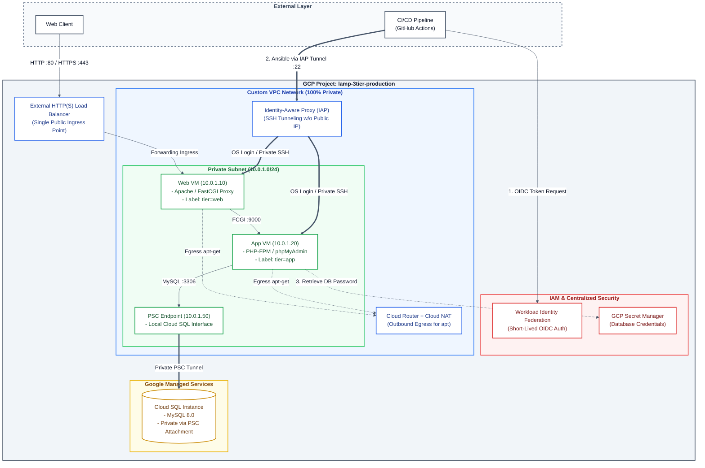

# Enterprise Zero-Trust 3-Tier LAMP Architecture on GCP

[](https://cloud.google.com/)
[](https://www.terraform.io/)
[](https://www.ansible.com/)
[](#security--zero-trust-posture)

> **Modernizing Legacy Architectures:** A production-grade, fully automated migration from a classic single-server LAMP stack to a Zero-Trust, highly secure 3-Tier infrastructure on Google Cloud Platform using Infrastructure as Code (IaC) and GitOps principles.

---

## Executive Summary

This repository demonstrates how to transition a traditional web application into a cloud-native, enterprise-grade environment. The architecture enforces strict network isolation, keyless access mechanisms, centralized secret handling, and dynamic CI/CD configuration management.

---

## Security & Zero-Trust Posture

* **100% Private Network (No Public IPs):** Web and Application Compute instances operate inside a strictly isolated VPC subnet with zero public IP addresses attached.
* **Identity-Aware Proxy (IAP) & OS Login:** Bastionless administration. SSH access is granted dynamic access through Google IAP tunnels authenticated via IAM roles.
* **Private Service Connect (PSC):** Cloud SQL database connectivity is exposed internally via a dedicated local PSC Endpoint (no VPC Peering or public IP exposure).
* **Workload Identity Federation (WIF):** Short-lived OIDC tokens for GitHub Actions runners, eliminating long-lived GCP service account keys.
* **Centralized Secret Management:** Database credentials and runtime configs are dynamically retrieved at boot via GCP Secret Manager.

---

## Architecture Diagram



---

## Repository Structure

```text
lamp-gcp-zero-trust/
├── .github/
│   └── workflows/          # GitHub Actions CI/CD (Terraform & Ansible Validation)
├── terraform/              # Infrastructure as Code (Modular Design)
│   ├── modules/            # Reusable modules (VPC, Compute, CloudSQL, IAP, IAM)
│   ├── main.tf             # Core provider configuration and remote state setup
│   ├── outputs.tf          # Provisioned infrastructure outputs
│   └── variables.tf        # Environment input variables
├── ansible/                # Configuration Management & Hardening
│   ├── inventory/          # Dynamic GCP Compute Inventory definitions
│   └── roles/              # Ansible roles (Apache, PHP-FPM, Security Hardening)
└── docs/                   # Detailed Project Documentation & Runbooks
    └── setup_guide.md      # Step-by-step infrastructure provisioning guide
```

---

## Implementation Roadmap

- [x] **Phase 1: Architecture & Network Topology Definition** (VPC, Subnetting, Security Boundaries)
- [x] **Phase 2: Repository Governance** (Branch Protection, GitOps Workflows)
- [x] **Phase 3: Core Infrastructure Provisioning (Terraform)**
  - [X] Custom VPC, Subnets, Cloud NAT & Router
  - [X] Private Compute Instances (Web & App Tiers)
  - [X] Cloud SQL (MySQL) with Private Service Connect (PSC)
- [X] **Phase 4: Security & IAM Hardening**
  - [X] Workload Identity Federation setup
  - [X] Secret Manager integration
  - [X] IAP SSH Tunneling configuration
- [ ] **Phase 5: Automated Configuration (Ansible)**
  - [ ] Web/App runtime setup (Apache, PHP-FPM)
  - [ ] OS Security hardening & dynamic inventory integration
- [ ] **Phase 6: Continuous Integration & Validation**

---

## Getting Started

To replicate or deploy this infrastructure, refer to the step-by-step setup documentation:
[Read the Setup Guide (docs/setup_guide.md)](docs/setup_guide.md)

---

## Author

* **Vladimir Evdokimov** - Cloud & DevOps Infrastructure Project  
* **GitHub:** [@vladimir-evdokimov-pro](https://github.com/vladimir-evdokimov-pro)