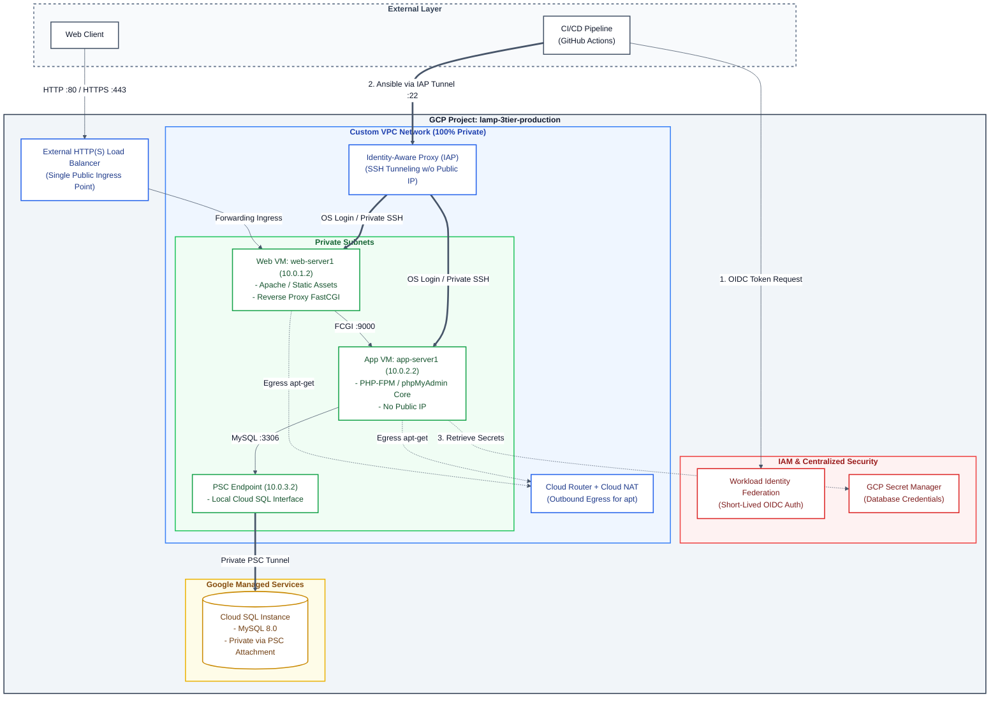

# Enterprise Zero-Trust 3-Tier LAMP Architecture on GCP

[](https://cloud.google.com/)
[](https://www.terraform.io/)
[](https://www.ansible.com/)
[](https://github.com/features/actions)
[](#security--zero-trust-posture)

> **Modernizing Legacy Architectures:** A production-grade, fully automated migration from a classic single-server LAMP stack to a Zero-Trust, highly secure 3-Tier infrastructure on Google Cloud Platform using Infrastructure as Code (IaC) and GitOps principles.

---

## Executive Summary

This repository demonstrates how to transition a traditional web application into a cloud-native, enterprise-grade environment. The architecture enforces strict network isolation, keyless access mechanisms, centralized secret handling, and dynamic configuration management driven by an automated GitHub Actions CI/CD pipeline.

---

## Security & Zero-Trust Posture

* **100% Private Network (No Public IPs on Internal Compute):** Application and Database tiers operate inside isolated VPC subnets without public IP addresses attached.
* **Identity-Aware Proxy (IAP) & OS Login:** Bastionless administration. SSH access is granted exclusively via dynamic Google IAP tunnels authenticated through IAM roles (`roles/iap.tunnelResourceAccessor`).
* **Private Service Connect (PSC):** Cloud SQL database connectivity is exposed internally via a dedicated local PSC Endpoint (no VPC Peering or public IP exposure).
* **Workload Identity Federation (WIF):** Short-lived OIDC tokens for GitHub Actions runners, eliminating long-lived GCP service account keys.
* **Centralized Secret Management:** Database credentials and runtime keys are dynamically retrieved via GCP Secret Manager.
* **Tiered Decoupling:** Apache serves static assets on the Web Tier and proxies FastCGI requests (`:9000`) to PHP-FPM running on an isolated App Tier.

---

## Architecture Diagram



---

## Repository Structure

```text
.
├── .github/
│   └── workflows/
│       ├── ci-pipeline.yml      # Code linting (ansible-lint, terraform fmt)
│       └── cd-pipeline.yml      # Terraform apply & Ansible deployment via IAP
├── README.md
├── ansible/
│   ├── ansible.cfg              # Global config with IAP SSH ProxyCommand
│   ├── inventory.gcp.yml        # GCP Compute dynamic inventory (auth_kind: application)
│   ├── group_vars/
│   │   ├── all.yml.example      # Environment variables template
│   │   ├── role_app.yml         # Application tier variables
│   │   └── role_web.yml         # Web tier variables
│   ├── playbooks/
│   │   ├── application.yml      # PHP-FPM & phpMyAdmin backend deployment
│   │   └── webserver.yml        # Apache HTTP Server, VHost & FastCGI proxy
│   └── templates/
│       ├── apache_vhost.conf.j2 # VirtualHost configuration with FastCGI proxy
│       ├── php_fpm_pool.conf.j2 # PHP-FPM pool configuration
│       └── pma_config.inc.php.j2# phpMyAdmin configuration template
├── docs/
│   ├── architecture_diagram.png # Architecture visual diagram
│   └── setup_guide.md           # Step-by-step installation & troubleshooting guide
└── terraform/
    ├── ansible.tf               # Integration helpers for Ansible inventory
    ├── main.tf                  # Infrastructure module invocations
    ├── outputs.tf               # Infrastructure deployment outputs
    ├── providers.tf             # Terraform provider definitions
    ├── terraform.tfvars.example # Input variables example template
    ├── variables.tf             # Core variable definitions
    └── modules/
        ├── compute/             # Virtual machine instances setup
        ├── database/            # Cloud SQL MySQL and PSC provisioning
        ├── load-balancer/       # GCP External HTTP Load Balancer setup
        ├── network/             # VPC, subnets, NAT, and firewall rules
        └── security/            # IAM, Service Accounts, Secret Manager & IAP
```

---

## Implementation Roadmap

- [x] **Phase 1: Architecture & Network Topology Definition** (VPC, Subnetting, Security Boundaries)
- [x] **Phase 2: Repository Governance** (Branch Protection, GitOps Workflows)
- [x] **Phase 3: Core Infrastructure Provisioning (Terraform)**
  - [x] Custom VPC, Subnets, Cloud NAT & Router
  - [x] Private Compute Instances (Web & App Tiers)
  - [x] Cloud SQL (MySQL) with Private Service Connect (PSC)
- [x] **Phase 4: Security & IAM Hardening**
  - [x] Workload Identity Federation (WIF) setup
  - [x] Secret Manager integration
  - [x] IAP SSH Tunneling configuration
- [x] **Phase 5: Automated Configuration (Ansible)**
  - [x] Web tier setup (Apache, FastCGI Proxy, Static Assets, VHost reload logic)
  - [x] App tier setup (PHP-FPM, phpMyAdmin Core execution)
  - [x] Dynamic inventory integration (`google.cloud.gcp_compute`)
- [x] **Phase 6: Continuous Integration & Delivery (CI/CD)**
  - [x] Automated `ansible-lint` and `terraform fmt` validation
  - [x] Automated CD execution over Zero-Trust IAP Tunnels via GitHub Actions

---

## Deployment Quickstart

### Prerequisites

* **Google Cloud SDK (`gcloud`)** installed and authenticated.
* **Terraform** `>= 1.5.0`
* **Ansible** `>= 2.15.0` with the `google.cloud` collection.
* IAM permission `roles/iap.tunnelResourceAccessor` granted to the executing entity.

### 1. Automated GitOps Deployment (Recommended)

Simply push changes to the `main` branch. GitHub Actions uses **Workload Identity Federation** to:
1. Provision/update GCP infrastructure using Terraform.
2. Open dynamic IAP SSH tunnels to configure private VMs via Ansible.

### 2. Manual CLI Deployment

#### Step 1: Provision Infrastructure
```bash
cd terraform
cp terraform.tfvars.example terraform.tfvars
# Update terraform.tfvars with your GCP project details
terraform init
terraform apply
```

#### Step 2: Deploy Software Stack
```bash
cd ../ansible
cp group_vars/all.yml.example group_vars/all.yml

# Run playbooks using GCP dynamic inventory through IAP tunnels
ansible-playbook -i inventory.gcp.yml playbooks/application.yml --private-key id_ssh
ansible-playbook -i inventory.gcp.yml playbooks/webserver.yml --private-key id_ssh
```

---

## Getting Started & Troubleshooting

For a deep dive into step-by-step setup, IAP tunnel configuration, dynamic inventory parameters, and post-deployment debugging, refer to:  
👉 [Read the Comprehensive Setup Guide (docs/setup_guide.md)](docs/setup_guide.md)

---

## Author

* **Vladimir Evdokimov** - Cloud & DevOps Infrastructure Project  
* **GitHub:** [@vladimir-evdokimov-pro](https://github.com/vladimir-evdokimov-pro)